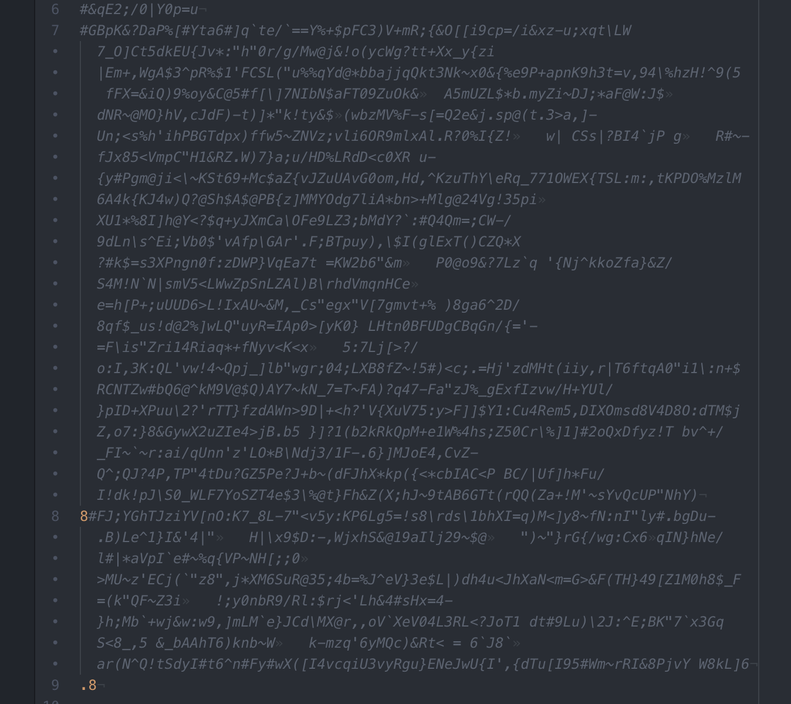

# escher
A self-writing program, like  M.C. Escher's "Drawing Hands"; completely unsupervised
https://en.wikipedia.org/wiki/Drawing_Hands

https://upload.wikimedia.org/wikipedia/en/b/ba/DrawingHands.jpg

# Goal
1) To find out: Can a program write itself completely unsupervised? If so, what will it make?
2) Give me an excuse to add more to github

# Initial Setup
First, I created a text file, hello_world.txt that is just a text file which has an "a" and that's it.
I use python packages "random" and to randomly grab characters from the package "string".

## Procedure
1) The program reads in hello_world.txt
2) It deletes the last character, and then adds 10 random characters.
3) It checks if what it just made is a runnable python program
4) If no, it keeps trying 2-3, if yes, it saves it
4) repeat

First, I set it up to go through 1000 cycles. One could also change it to be a 'while loop' which infinitely adds onto the program

## Initial Results
After 1000 tries, all it did was make a program that was almost all "commented out" with the pound symbol, something many coders learn on their first day of coding. There are thousands of commented out (non-functioning) characters except for the number 8 and the number .8. 

This is pretty interesting.
But also... not really. Very sloppy coding mister! ... and it doesn't do anything except pass 8 and .8...
I'm wondering if I should not allow it to use "#" to help encouragage it to make something which actually does something, and make it easier for me to figure out what it is doing...

I'd rather not give it any rules... stay tuned

For now, I just think it is funny that you can actually copy and paste this rediculous, messy, nonsensical txt made from this Escher program and run it and it works! It doesn't print anything or do anything, but it doesn't fail either, which in a way, makes it a better programmer than me. I deal with errors all the time, but in about 1 second, it was able to write error-free code!

# Disclaimer
The uploaded version of escher has only 1000 rounds allowed (I test 'infinite mode' on my own). You should ONLY put it in 'infinite mode' (turning it into a "while true:" loop) if you are a programmer and know what you are doing. For now, it writes nonsense, but there is some potential for serious DANGER! It is is running python's 'exec' command to check if what escher made is executable or not. It is possible for it to write a program which deletes everything on your computer, leaks passwords etc. This project is for curiosity purposes at this point, and a bit tongue-in-cheek (I don't have much expectation for it) but it should still be treated with care and respect. Push ctrl-z and kill it while it is running if you suspect something weird happening! If you do mess around with it- let me know if you find anything cool, or have some tips!
